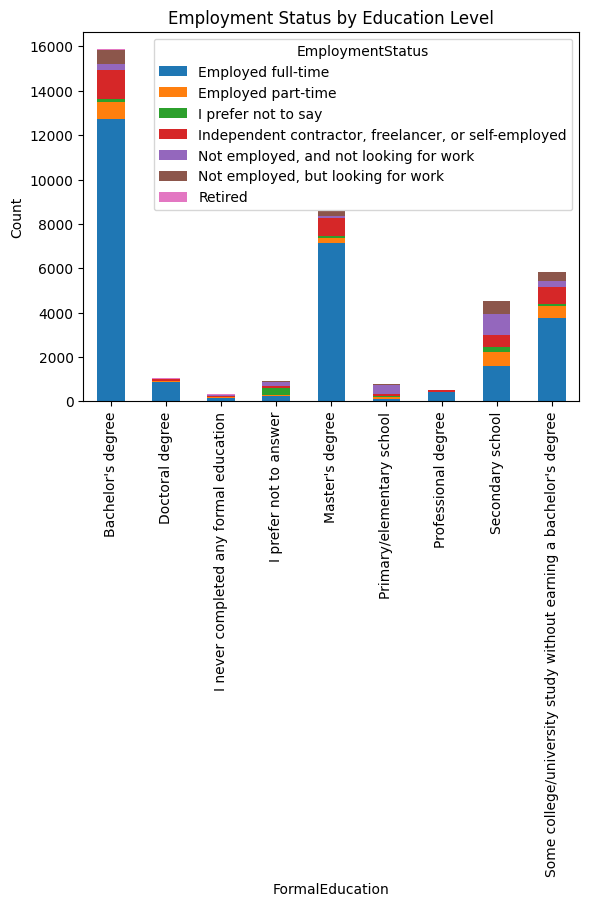
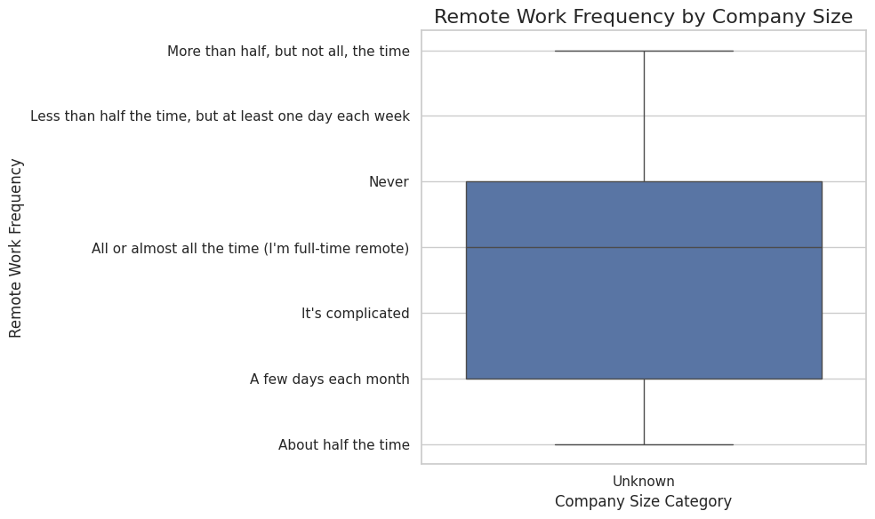
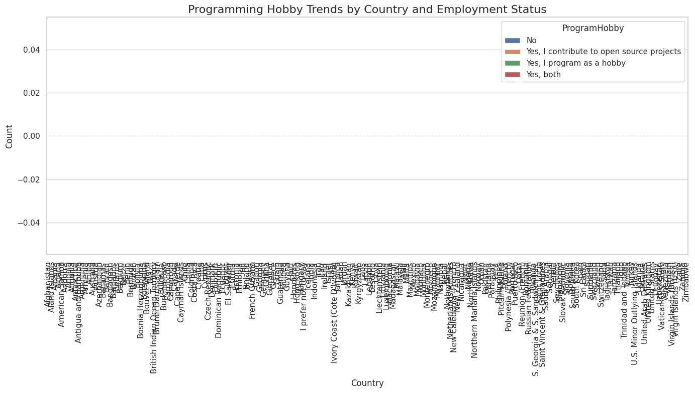
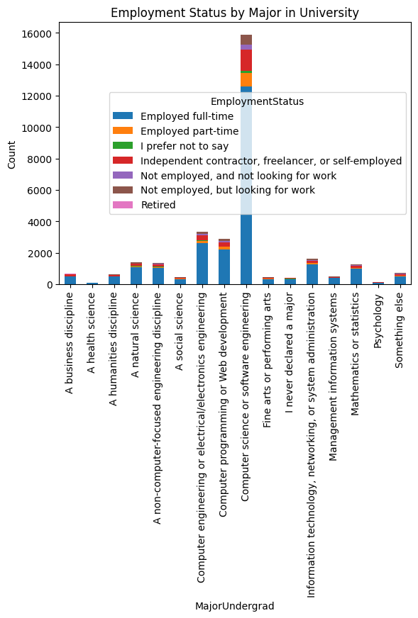
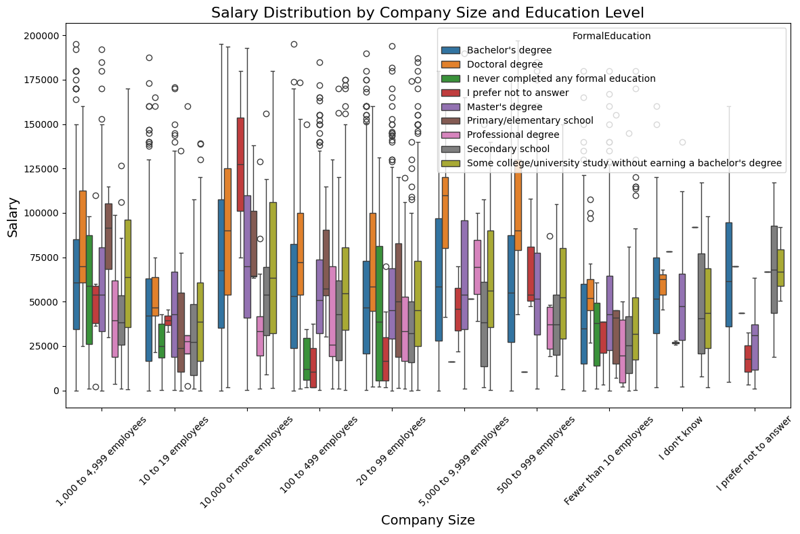

# Data Science Project: Stack Overflow Survey Analysis
## 1. Business Understanding
Every year, Stack Overflow conducts a massive survey of people on the site, covering all sorts of information like programming languages, salary, code style and various other information. This year, they amassed more than 64,000 responses fielded from 213 countries.

### Questions:
How does the highest level of formal education (Bachelor's, Master's, etc.) correlate with employment status in the tech industry?
What is the relationship between the frequency of remote work and company size (number of employees)?
What are the programming hobby trends across different countries and how do they correlate with employment in the tech industry?
How does the employment status (full-time vs. freelance) vary by the field of study in university (e.g., Computer Science vs. Other fields)?
What are the salary distributions across different company sizes and education levels?

### Question 1: Employment Status by Education Level
Question: How does the highest level of formal education correlate with employment status in the tech industry?
Method: Group data by FormalEducation and EmploymentStatus and visualize using a stacked bar chart.

### Question 2: Remote Work Frequency by Company Size
Question: What is the relationship between the frequency of remote work and company size (number of employees)?
Method: Use a boxplot to visualize remote work frequency for different company sizes.

### Question 3: Programming Hobby Trends by Country and Employment Status
Question: What are the programming hobby trends across different countries and how do they correlate with employment in the tech industry?
Method: Use a bar chart to show programming hobby trends by country and employment status.

### Question 4: Employment Status by Major in University
Question: How does employment status vary by field of study in university (e.g., Computer Science vs Other fields)?
Method: Group by MajorUndergrad and EmploymentStatus and visualize with a bar plot.

### Question 5: Salary Distribution by Company Size and Education Level
Question: What are the salary distributions across different company sizes and education levels?
Method: Use a boxplot to visualize salary distribution based on company size and education level.

## Libraries Used

The following libraries were used to perform the analysis and create visualizations:
- **Pandas**: Data manipulation and analysis.
- **Seaborn**: Statistical data visualization.
- **Matplotlib**: Plotting and chart generation.

## Installation

To set up the environment and run the analysis, follow these steps:

1. Clone this repository: git clone https://github.com/bdtinh1999/Data_Science-Write_A_Data_Science_Blog_Post.git

2. Install the required libraries: pip install -r requirements.txt

3. Run the Jupyter notebook: jupyter notebook

## Acknowledgments

- Thanks to Stack Overflow for providing the survey data.
- Special thanks to various online communities (like Stack Overflow, Kaggle, etc.) for helping with the code and analysis techniques.

# link of the blog post: https://medium.com/@bdtinh1999/59b2ff94157e